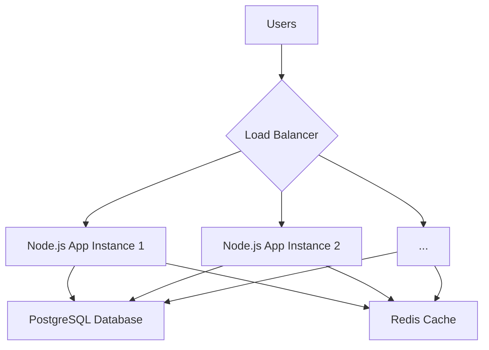

# System Architecture

This document describes the system architecture for the Task Management application, designed to support 100,000 users and 1,000,000 tasks efficiently.

## Core Components

The system is composed of the following core components:

*   **Node.js Application:** A single-instance Node.js application built with the Express framework. This can be scaled horizontally behind a load balancer.
*   **PostgreSQL Database:** A relational database used as the primary data store.
*   **Redis:** An in-memory data store used for caching.
*   **Docker:** The entire application is containerized using Docker for portability and ease of deployment.

## Database

**Choice:** PostgreSQL

**Reasoning:**

*   **Relational Integrity:** A relational database is ideal for this application due to the clear relationships between users and tasks. PostgreSQL's support for transactions ensures that operations like creating a task are atomic.
*   **Scalability:** PostgreSQL is highly scalable. It supports various indexing strategies, and with features like table partitioning, it can efficiently handle millions of tasks.
*   **JSON Support:** PostgreSQL has excellent support for JSONB, which can be useful for storing flexible data structures if needed in the future.

## Caching

**Choice:** Redis

**Reasoning:**

*   **Performance:** Redis is an in-memory key-value store, which makes it incredibly fast for read and write operations. It's perfect for caching frequently accessed data that doesn't change often.
*   **Data Structures:** Redis provides versatile data structures like sorted sets, which are ideal for implementing leaderboards.
*   **Use Cases:**
    *   **Leaderboard:** The user leaderboard, which shows users with the most completed tasks, will be cached in Redis to provide near-instantaneous responses.
    *   **Task Lists:** Paginated task lists for individual users will be cached to reduce the load on the database.

## Scaling

The system is designed to be scalable both horizontally and vertically.

*   **Horizontal Scaling:** The Node.js application is stateless, meaning that any instance of the application can handle any user request. This allows us to add more application instances behind a load balancer as the number of users grows.
*   **Vertical Scaling:** If needed, we can also scale vertically by increasing the CPU and memory resources of the application and database servers.
*   **Database Scaling:** The PostgreSQL database can be scaled using techniques like read replicas. Read-heavy queries (like fetching tasks) can be directed to read replicas, while write operations go to the primary database.

## Future Considerations: Microservices

As the application grows in complexity, we can consider breaking it down into microservices. For example, we could have separate services for:

*   **User Service:** Manages user authentication and profiles.
*   **Task Service:** Manages task-related operations.
*   **Analytics Service:** Manages analytics and reporting.

This would allow for independent scaling and development of each service.
